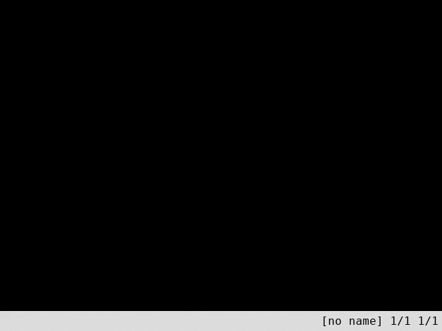

# Vimol 2.0

Vimol is a powerful molecular viewer and editor. Vimol features
vi-like key bindings, fast and lightweight design, editing in multiple tabs,
visualization of trajectories, unlimited undo/redo, command record/replay,
and much more! Vimol does not require the mouse, and most things
can be accomplished in less than 5 keystrokes. Use **h**/**j**/**k**/**l**
keys to rotate the molecule and **q** to exit the program.
Multi-frame **pdb** and **xyz** file formats are supported for viewing
and editing. For the detailed documentation consult the vimol(1) manual
page ([html](https://vimol.github.io/vimol.1.html),
[pdf](https://vimol.github.io/vimol.1.pdf)).

### Compilation from sources

To obtain vimol source code, download the latest
[tarball archive](https://github.com/ilyak/vimol/archive/master.tar.gz) or
use [git](https://git-scm.com) to clone the repository:

	git clone https://github.com/ilyak/vimol

To compile vimol from source you will need an ANSI C complaint compiler and a
make utility. The following dependencies should also be installed along
with their corresponding development packages:

###### Cairo

Cairo graphics library (https://cairographics.org). Version 1.12.0 or newer
is recommended.

  - Fedora Linux: `yum install cairo-devel`
  - Ubuntu Linux: `apt-get install libcairo-dev`
  - FreeBSD: `pkg install cairo`
  - OpenBSD: `pkg_add cairo`
  - Mac OS X: see [this](https://cairographics.org/download/) page

###### SDL2

Simple direct-media layer (https://libsdl.org). Version 2.0.1 or newer is
recommended. Make sure that the video support is turned on if building SDL from
source.

  - Fedora Linux: `yum install SDL2-devel`
  - Ubuntu Linux: `apt-get install libsdl2-dev`
  - FreeBSD: `pkg install sdl2`
  - OpenBSD: `pkg_add sdl2`
  - Mac OS X: see [this](https://libsdl.org/download-2.0.php) page

After installing all dependencies, compile vimol by issuing:

	make

To install vimol, issue as root:

	make install

Use `vimol` to start the program, and `man vimol` to see the manual page.
