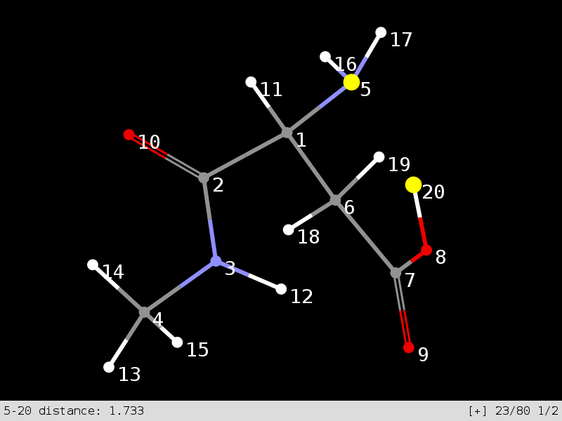

# Vimol

Vimol is a powerful molecular viewer and editor inspired by vim. Vimol features
vim-like key bindings, editing in multiple windows, visualization of
trajectories, unlimited undo/redo, and much more! Vimol does not require mouse,
and most things can be accomplished in less than 5 keystrokes. For more
information and tutorials consult online documentation at http://www.vimol.org/
web site.

### Compilation from sources

To compile vimol from source you will need an ANSI C complaint compiler and a
make utility. You will also need the following dependencies installed along
with their corresponding development packages:

 * Cairo graphics library (cairographics.org). Version 1.12.0 or
   newer is recommended.

  - OpenBSD: `pkg_add cairo`
  - FreeBSD: `pkg install cairo`
  - Ubuntu: `apt-get install libcairo-dev`
  - Fedora: `yum install cairo-devel`

 * Simple direct-media layer (libsdl.org). Version 2.0.1 or newer is
   recommended. Make sure that the video support is turned on if building SDL
   from source.

  - OpenBSD: `pkg_add sdl2`
  - FreeBSD: `pkg install sdl2`
  - Ubuntu: `apt-get install libsdl2-dev`
  - Fedora: `yum install SDL2-devel`

After installing all dependencies, compile vimol by typing:

	make

To install the vimol binary issue:

	make install

For documentation and tutorials visit http://www.vimol.org/ web site.
